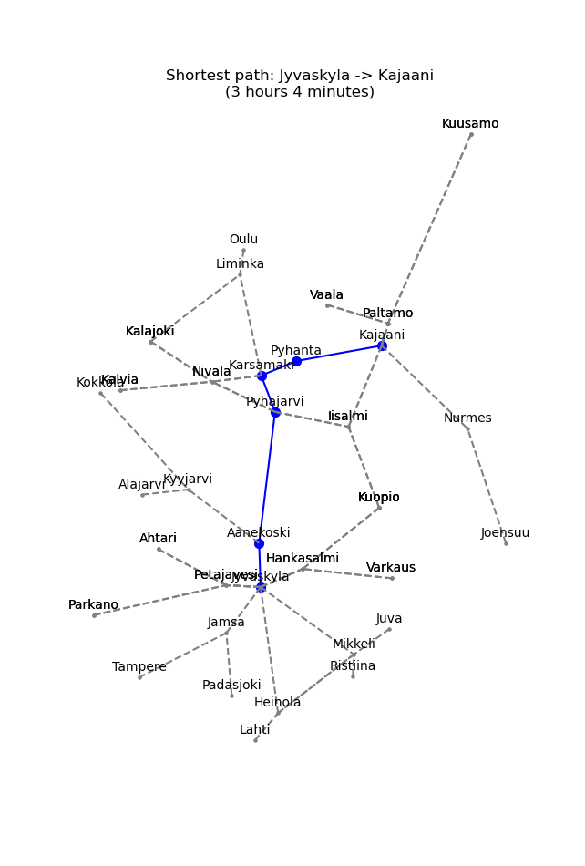

# Testing Documentation
*Author:* Henrik Harjula  
*Course:* Aineopintojen harjoitustyö: Tietorakenteet ja algoritmit (loppukesä 2021)  
*Study program:* Mathematical Sciences (Matemaattiset tieteet)  
*Programming language for project:* Python  

## Topic
Topic of this project is to make a pathfinding application. Two (shortest) pathfinding algorithms are used to compare their effectiveness (in terms of runtime) in finding the quickest path from one Finnish city to another Finnish city using Finnish highways (valtatie in Finnish). Speed limits of different highways are taken into account. Purpose is to find the quickest path(s) (not necessarily shortest) when driving with car. Application is used from command line – when a shortest path is queried, then a popup window visualizing resulting shortest path(s) is opened.

## Test reports
[Test coverages](https://github.com/henkkah/pathfinding/tree/master/documentation/test_coverages)  
[Pylint ratings](https://github.com/henkkah/pathfinding/tree/master/documentation/pylint_ratings)  

## What and how was tested

### Application testing
Working of Dijkstra's algorithm, IDA* algorithm, and self-coded heap data structure has been tested with unittesting.
There are both example graphs and a real graph (Finnish map) used in the tests.
In the example graphs Dijkstra's and IDA* algorithms have been tested to give correct shortest distances and paths (determined by the programmer).
For IDA* a pixel graph was created in order to be able to give heuristics to the algorithm.
Heap is tested with an example graph to contain correct min value during insertions and pop-ups.
Finally, working of both algorithms is tested with real graph (Finnish map) by testing that the algorithms give correct shortest paths.
Correct paths have been determined by the programmer manually, as the graph is real and there is no automatic way to determine correct solutions.

### Performance testing
Performance testing has been conducted to analyze performance of Dijkstra's algorithm vs. IDA* algorithm.
Performance is tested with a module which randomly chooses desired number of start cities and end cities and calculates runtimes of both algorithms in finding shortest paths between those cities.
Runtimes are saved to a list, and then for analysis purposes paths are categorized into short-range, mid-range, and long-range paths based on euclidean distance between start and end cities.
Paths are categorized into three categories so that all categories contain same amount of paths (e.g. with 15 paths, there are 5 short-range, 5 mid-range, and 5 long-range paths).
With this categorization, it is easy to make analysis on how algorithms behave in different kind of distances and paths.

## Inputs for testing
There are both example graphs (created by the programmer) and a real graph (Finnish map) given as input for testing.

## Repeating tests
Both Application testing and Performance testing can be repeated easily.
Application tests (unittesting) can be done each time desired, and testing module gives automatic reports on the results.
Performance tests can also be repeated as often as desired - new random start and end cities of course give each time different results, so repeating performance testing is recommended with different kinds of setups.

## Empirical test results in graphical format
Here are a few shortest paths found by the application:  
  
Helsinki-Tampere:  
  
Jyväskylä-Kajaani:  
  
Kuusamo-Kilpisjärvi:  
  
